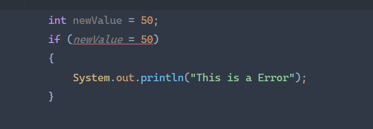
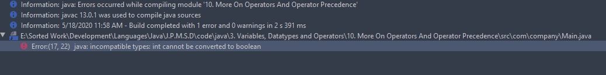
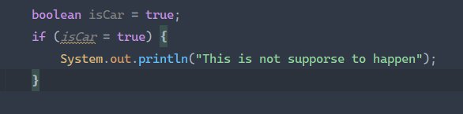
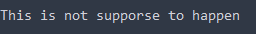
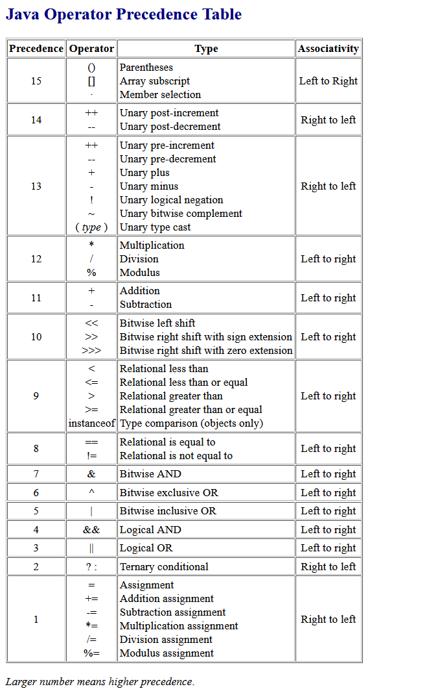

# More Operators

## Error



= cannot be used because it means newValue = 50 not a condition

## Output


## but this doesn't give error



## output



## Java Operator presedent Table



## Final Code Example 

```java
package com.timbuchalka;

public class Main {

    public static void main(String[] args) {
        int result = 1 + 2;
        System.out.println("1 + 2 = " + result);

        int previousResult = result;

        result = result - 1;
        System.out.println(previousResult + " - 1 = " + result);

        previousResult = result;

        result = result * 10;
        System.out.println(previousResult + " * 10 = " + result);

        previousResult = result;

        result = result / 5;
        System.out.println(previousResult + " / 5 = " + result);

        previousResult = result;
        result = result % 3;
        System.out.println(previousResult + " % 3 = " + result);

        previousResult = result;
        result = result + 1;
        System.out.println("Result is now " + result);
        result++;
        System.out.println("Result is now " + result);
        result--;
        System.out.println("Result is now " + result);

        result += 2;
        System.out.println("Result is now " + result);
        result *= 10;
        System.out.println("Result is now " + result);
        result -= 10;
        System.out.println("Result is now " + result);
        result /= 10;
        System.out.println("Result is now " + result);


        boolean isAlien = false;
        if (isAlien == true)
            System.out.println("It is not an alien!");

        int topScore = 80;
        if (topScore < 100)
            System.out.println("You got the high score!");

        int secondTopScore = 81;
        if (topScore > secondTopScore && topScore < 100)
            System.out.println("Greater than second top score and less then 100");

    }
}

```

